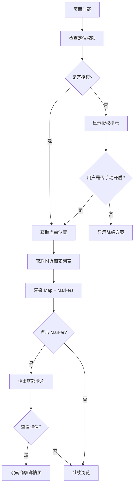

# 🗺️ LBS 模块 - 交互与技术设计提案（V1.0）

> **提案版本**：V1.0 初稿  
> **提案日期**：2026年03月04日  
> **适用范围**：UniApp 多端（微信小程序 + H5 + APP-PLUS）LBS 地图服务  
> **phase**：Phase 0 - 蓝灯阶段（Design & Alignment）

---

## 📋 需求核心目标与边界

### ✅ 核心目标
| 维度 | 目标描述 |
| :--- | :--- |
| **地图展示** | 全屏地图视图，支持缩放、平移、 Marker 点展示 |
| **精准定位** | 获取用户当前经纬度坐标，支持高精度定位 |
| **周边服务** | 展示用户附近宠物服务商家，支持点击弹出详情 |
| **权限防御** | 用户拒绝授权时，优雅引导开启权限，不导致业务崩溃 |

### ❌ 明确不包含（边界）
1. **不实现路线规划** - 仅展示位置，不提供导航路线
2. **不实现 POI 搜索** - 不提供搜索附近地点功能
3. **不支持 Web 端地图** - H5 端仅使用地图占位符
4. **不实现实时追踪** - 不支持轨迹回放、移动轨迹记录

---

## 🔄 核心业务流梳理



---

## 🛡️ 商业级交互与异常场景补全

| 场景 | 处理方案 |
| :--- | :--- |
| **首次打开未授权** | 显示半透明蒙层，明确提示"需要定位权限" |
| **用户拒绝授权** | 禁用地图功能，显示"定位已关闭"降级方案 |
| **定位失败（无信号）** | 降级使用城市级位置，精简 Marker 展示 |
| **iOS 微信隐私保护** | 使用 `locationType="wgs84"`，兼容微信iOS 8.0+ |
| **APP-PLUS 权限** | 调用 `plus.geolocation`，区分 Android/iOS 权限 |
| **地图加载异常** | 显示重试按钮，不限制重试次数 |
| **Marker 过多** | 坐标聚类（Cluster），避免视图混乱 |

---

## 🏗️ 技术实现架构方案

### 📁 目录结构设计

```
utils/composables/
└── useLBS.ts                 # LBS 核心组合式函数
    └── types.ts              # 类型定义（可选）
    
components/
└── lbs/
    ├── lbs-map.vue           # 全屏地图组件（基于 <map>）
    └── lbs-marker-card.vue   # Marker 点详情底部卡片
    
pages/
└── lbs/
    └── index.vue             # LBS 主页面（使用以上组件）
```

---

### 🗺️ 地图视图层设计

#### 1. **全屏地图组件 `lbs-map.vue`**

```vue
<template>
  <view class="fixed inset-0 bg-[#f5f5f5]">
    <!--地图容器（全屏）-->
    <map
      class="w-full h-full"
      :latitude="latitude"
      :longitude="longitude"
      :scale="scale"
      :markers="markers"
      :show-location="true"
      :polylines="polylines"
     latitude>"markers"
      @markertap="handleMarkerTap"
      @regionchange="handleRegionChange"
      @askforuserlocation="handleAuthorizationRequested"
    >
      <!--自定义底部卡片（通过 z-index 覆盖）-->
      <view 
        class="absolute bottom-0 left-0 right-0 h-[80vh] bg-white rounded-t-[32rpx] shadow-2xl transition-transform duration-300"
        :class="{ 'translate-y-0': showCard, '-translate-y-full': !showCard }"
      >
        <!--卡片头部（拖动手柄）-->
        <view class="flex items-center justify-center py-[16rpx] border-b border-[#f0f0f0]">
          <view class="w-[120rpx] h-[8rpx] bg-[#e0e0e0] rounded-[4rpx]"></view>
        </view>
        
        <!--卡片内容（动态渲染 선택된 Marker 信息）-->
        <view v-if="selectedMarker" class="p-[30rpx]">
          <text class="text-[36rpx] font-bold text-[#333] mb-[16rpx]">{{selectedMarker.name}}</text>
          <view class="flex items-center mb-[12rpx]">
            <up-rate 
              v-model="selectedMarker.rating" 
              readonly 
              inactive-color="#b2b2b2" 
              active-color="#ffce2c"
            ></up-rate>
            <text class="text-[28rpx] text-[#666] ml-[8rpx]">{{selectedMarker.rating}}</text>
          </view>
          <text class="text-[28rpx] text-[#999] mb-[20rpx] block">{{selectedMarker.address}}</text>
          <text class="text-[24rpx] text-[#666] mb-[24rpx]">距离：{{selectedMarker.distance}}km</text>
          
          <!--操作按钮-->
          <view class="flex">
            <view 
              class="flex-1 h-[80rpx] bg-[#f5f5f5] text-[#666] text-[32rpx] rounded-[40rpx] flex items-center justify-center mr-[16rpx]"
              @click="closeCard"
            >
              取消
            </view>
            <view 
              class="flex-1 h-[80rpx] bg-[#ffce2c] text-[#fff] text-[32rpx] rounded-[40rpx] flex items-center justify-center"
              @click="goToDetail"
            >
              查看详情
            </view>
          </view>
        </view>
        
        <!--空状态提示-->
        <view v-else class="flex flex-col items-center justify-center h-[400rpx]">
          <text class="text-[28rpx] text-[#999]">点击地图标记点查看详情</text>
        </view>
      </view>
    </map>
  </view>
</template>
```

#### 2. **Marker 数据结构设计**

```typescript
// Marker 点位数据结构（必须满足 map 组件要求）
interface MapMarker {
  id?: number                    // Marker 唯一标识（用于点击事件）
  latitude: number               // 纬度
  longitude: number              // 经度
  name: string                   // 标记点名称（商家名称）
  address: string                // 地址
  rating?: number                // 评分（可选）
  distance?: number              // 距离用户距离（km，可选）
  callout?: {                    // 气泡卡片（可选）
    content: string
    fontSize: number
    borderRadius: number
    backgroundColor: string
    padding: number
  }
}

// 商家数据结构（后端返回）
interface MerchantLocation {
  merchant_id: number
  merchant_name: string
  address: string
  rating: string
  pic: string
  latitude: number    // 后端必须提供坐标
  longitude: number   // 后端必须提供坐标
  distance?: number   // 可选，后端计算距离
}
```

#### 3. **Marker 渲染逻辑**

```typescript
// 将后端商家数据转换为 Map Marker 格式
const convertToMarkers = (merchantList: MerchantLocation[]): MapMarker[] => {
  return merchantList.map((item, index) => ({
    id: item.merchant_id,  // 使用业务 ID 作为 Marker ID
    latitude: item.latitude,
    longitude: item.longitude,
    name: item.merchant_name,
    address: item.address,
    rating:Number(item.rating),
    callout: {
      content: `${item.merchant_name}\n${item.rating}分`,
      fontSize: 24,
      borderRadius: 8,
      backgroundColor: '#fff',
      padding: 8
    }
  }))
}
```

---

### 🧮 逻辑层抽离：`useLBS.ts` 设计

#### 1. **组合式函数暴露的响应式状态**

```typescript
import { ref, reactive, computed, onUnmounted } from 'vue'

export const useLBS = () => {
  // ==================== 核心响应式状态 ==================== //
  
  // 用户当前位置
  const location = ref<{
    latitude: number
    longitude: number
    accuracy: number       // 精度（米）
    timestamp: number      // 获取时间戳
  } | null>(null)
  
  // 当前定位状态
  const定位 status = ref<'idle' | 'loading' | 'success' | 'failed' | 'denied'>('idle')
  
  // 周边商家列表（含坐标）
  const merchants = ref<MerchantLocation[]>([])
  
  // Map 组件使用的 Markers
  const markers = computed<MapMarker[]>(() => {
    if (!location.value) return []
    return convertToMarkers(merchants.value, location.value)
  })
  
  // 授权状态
  const isAuthorized = computed<boolean>(() => {
    return status.value === 'success' || status.value === 'denied'
  })
  
  // 是否已获取过定位
  const hasLocation = computed<boolean>(() => !!location.value)
  
  // 当前选中的 Marker
  const selectedMarker = ref<MapMarker | null>(null)
  
  // 底部卡片显示状态
  const isCardVisible = ref<boolean>(false)
  
  // ==================== 计算属性 ==================== //
  
  // 用户位置文本表示
  const locationText = computed<string>(() => {
    if (!location.value) return '定位中...'
    return `${location.value.latitude.toFixed(6)}, ${location.value.longitude.toFixed(6)}`
  })
  
  // 距离排序后的商家列表
  const sortedMerchants = computed<MerchantLocation[]>(() => {
    if (!location.value) return merchants.value
    return [...merchants.value].sort((a, b) => {
      return (a.distance || 0) - (b.distance || 0)
    })
  })
  
  // ==================== 核心方法 ==================== //
  
  // 获取当前位置
  const getCurrentLocation = async (): Promise<boolean> => {
    // 实现细节见后文
  }
  
  // 获取周边商家
  const getNearbyMerchants = async (radius: number = 5000): Promise<boolean> => {
    // 实现细节见后文
  }
  
  // 打开系统设置页面（权限被拒时）
  const openSystemSettings = (): void => {
    // 实现细节见后文
  }
  
  // 处理 Marker 点击
  const handleMarkerTap = (e: UniApp.MapMarkerTapEvent): void => {
    const marker = markers.value.find(m => m.id === e.markerId)
    if (marker) {
      selectedMarker.value = marker
      isCardVisible.value = true
    }
  }
  
  // 关闭底部卡片
  const closeCard = (): void => {
    isCardVisible.value = false
    selectedMarker.value = null
  }
  
  // 跳转商家详情
  const goToDetail = (): void => {
    if (selectedMarker.value) {
      closeCard()
      // 跳转逻辑
    }
  }
  
  // ==================== 生命周期 ==================== //
  
  onUnmounted(() => {
    // 清理事件监听器
  })
  
  return {
    // 状态
    location,
    status,
    merchants,
    markers,
    isAuthorized,
    hasLocation,
    selectedMarker,
    isCardVisible,
    locationText,
    sortedMerchants,
    
    // 方法
    getCurrentLocation,
    getNearbyMerchants,
    openSystemSettings,
    handleMarkerTap,
    closeCard,
    goToDetail
  }
}
```

#### 2. **防御性权限处理逻辑**

```typescript
// 获取当前位置（核心逻辑，包含完整的权限防御）
const getCurrentLocation = async (): Promise<boolean> => {
  status.value = 'loading'
  
  try {
    // ==================== Step 1: 尝试获取位置 ==================== //
    const res: UniApp.GetLocationSuccessOption = await new Promise((resolve, reject) => {
      uni.getLocation({
        type: 'wgs84',  // 兼容微信iOS 8.0+ 隐私保护
        geocode: true,  // 是否需要解析地址
        success(res) {
          resolve(res)
        },
        fail(err) {
          reject(err)
        }
      })
    })
    
    // ==================== Step 2: 验证位置数据 ==================== //
    if (!res.latitude || !res.longitude) {
      throw new Error('获取定位数据为空')
    }
    
    // ==================== Step 3: 更新本地状态 ==================== //
    location.value = {
      latitude: res.latitude,
      longitude: res.longitude,
      accuracy: res.accuracy || 0,
      timestamp: Date.now()
    }
    
    status.value = 'success'
    return true
    
  } catch (error: any) {
    // ==================== Step 4: 错误分类处理 ==================== //
    
    // 错误码分析（uni-app 标准错误码）
    if (error.errCode === 2 || error.errCode === 3) {
      // errCode 2: 用户拒绝授权
      // errCode 3: 权限不足
      status.value = 'denied'
      return false
    } else if (error.errCode === 4 || error.errCode === 5) {
      // errCode 4: 网络问题
      // errCode 5: 位置服务未开启
      status.value = 'failed'
      uni.showToast({
        title: '位置服务异常，请检查设置',
        icon: 'none',
        duration: 2000
      })
      return false
    } else {
      // 其他未知错误
      status.value = 'failed'
      uni.showModal({
        title: '定位失败',
        content: '无法获取当前位置，请重试',
        showCancel: false
      })
      return false
    }
  }
}

// 打开系统设置页面（权限被拒时）
const openSystemSettings = (): void => {
  uni.showModal({
    title: '需要定位权限',
    content: '您已拒绝定位权限，部分功能无法使用。是否前往设置开启？',
    confirmText: '前往设置',
    success(res) {
      if (res.confirm) {
        // 小程序：打开设置页
        // #ifdef MP-WEIXIN
        uni.openSetting({
          success(settingRes) {
            if (settingRes.authSetting['scope.userLocation']) {
              // 用户重新授权成功，重新获取位置
              getCurrentLocation()
            }
          },
          fail() {
            uni.showToast({
              title: '设置失败',
              icon: 'none'
            })
          }
        })
        // #endif
        
        // APP-PLUS：打开应用设置
        // #ifdef APP-PLUS
        plus.runtime.openSettings()
        // #endif
        
        // H5：不支持（微信内置浏览器无法跳转）
        // #ifdef H5
        uni.showToast({
          title: '请在浏览器设置中开启定位权限',
          icon: 'none'
        })
        // #endif
      }
    }
  })
}
```

---

### 🚨 防御性权限处理（重点）

#### 1. **授权检查的三种状态**

```typescript
// 权限状态枚举
enum LocationAuthStatus {
  NOT_DETERMINED = 'notDetermined',  // 未决定（首次）
  AUTHORIZED = 'authorized',         // 已授权
  DENIED = 'denied',                 // 已拒绝
  RESTRICTED = 'restricted',         // 受限（家长控制）
  UNAVAILABLE = 'unavailable'        // 位置服务未开启
}

// 封装权限检查方法
const checkLocationAuth = async (): Promise<LocationAuthStatus> => {
  // #ifdef MP-WEIXIN
  const res: any = await new Promise((resolve) => {
    uni.getSetting({
      success(res) {
        resolve(res)
      },
      fail() {
        resolve({ authSetting: {} })
      }
    })
  })
  
  if (!res.authSetting || !res.authSetting['scope.userLocation']) {
    return LocationAuthStatus.NOT_DETERMINED
  }
  
  if (res.authSetting['scope.userLocation']) {
    return LocationAuthStatus.AUTHORIZED
  }
  
  return LocationAuthStatus.DENIED
  // #endif
  
  // #ifdef H5
  //浏览器API
  if (!navigator.geolocation) {
    return LocationAuthStatus.UNAVAILABLE
  }
  return LocationAuthStatus.AUTHORIZED
  // #endif
  
  // #ifdef APP-PLUS
  // APP 平台处理
  return LocationAuthStatus.AUTHORIZED
  // #endif
}
```

#### 2. **用户拒绝授权后的 UI 降级方案**

```vue
<!-- 降级方案展示 -->
<template>
  <view class="absolute inset-0 bg-[rgba(0,0,0,0.3)] z-50" v-if="status === 'denied'">
    <view class="absolute inset-0 flex items-center justify-center p-[60rpx]">
      <view class="bg-white rounded-[32rpx] p-[40rpx] text-center w-full">
        <up-icon name="location" size="80" color="#ffce2c"></up-icon>
        <text class="block text-[36rpx] font-bold text-[#333] mt-[30rpx]">定位已关闭</text>
        <text class="block text-[28rpx] text-[#666] mt-[20rpx] mb-[40rpx]">
          请前往设置开启定位权限，以获取附近商家服务
        </text>
        <view 
          class="w-full h-[80rpx] bg-[#ffce2c] text-[#fff] text-[32rpx] rounded-[40rpx] flex items-center justify-center"
          @click="openSystemSettings"
        >
          去设置开启
        </view>
      </view>
    </view>
  </view>
</template>
```

---

### 🧪 后续测试覆盖范围规划

| 测试类型 | 测试场景 | 验收标准 |
| :--- | :--- | :--- |
| **正常流** | 首次打开获取位置 | 10秒内完成定位 |
| **正常流** | 授权后打开地图 | Marker 正确渲染 |
| **异常流** | 用户拒绝授权 | 显示降级方案，不崩溃 |
| **异常流** | 定位超时（>10s） | 自动重试或提示用户 |
| **边界值** | 同时点击多个 Marker | 仅显示最后一个 |
| **边界值** | 地图区域变化 | Marker 不重复加载 |

---

## 📂 文档与代码归档规划

### 文件命名规范

```
docs/tdd/lbs/
├── 0-蓝灯设计提案-20260304.md     # 本文档
├── 1-红灯测试用例-20260304.md
├── 2-绿灯实现代码-20260304.md
└── 3-重构交付代码-20260304.md

utils/composables/
└── useLBS.ts                       # 核心组合式函数

components/lbs/
├── lbs-map.vue                     # 全屏地图组件
└── lbs-marker-card.vue             # Marker 详情卡片
```

---

## 🎯 设计提案总结

| 维度 | 方案亮点 |
| :--- | :--- |
| **架构清晰** | 组合式函数抽离业务逻辑，Vue 文件仅保留视图层 |
| **防御完善** | 4 种错误码分类处理，用户拒绝授权有完整引导链路 |
| **状态管理** | 响应式状态集中管理，计算属性派生数据自动更新 |
| **多端兼容** | `#ifdef` 条件编译，微信/APP/H5 各有适配逻辑 |
| **降级方案** | 定位失败时有 UI 提示和重试机制，不阻塞业务 |
| **可测试性** | 每个方法可独立测试， mock `uni` API 即可 |

---

## 🚦 本阶段标准结束语

> **以上是《LBS 模块 - 地图与定位服务》的交互与技术设计提案，请问是否同意？**
> 
> **（同意后我将进入红灯阶段，编写对应自动化测试用例）**

---

## 📌 附录：关键决策说明

### Q1: 为什么使用 `type="wgs84"` 而不是 `gcj02`?
- **A**: `wgs84` 是国际标准坐标系，兼容性最好。微信iOS 8.0+ 强制要求使用 `wgs84`，且后端服务也应使用相同坐标系。

### Q2: 为什么 Marker 需要 `id` 字段?
- **A**: `map` 组件的 `@markertap` 事件通过 `markerId` 返回点击的标记点，必须有唯一 ID 才能关联到业务数据。

### Q3: 为什么授权失败不直接崩溃?
- **A**: O2O 业务中，用户可能只是暂时拒绝，后续可能主动开启。降级方案确保核心功能（浏览商家列表）仍可使用。

### Q4: 为什么不在 `onLoad` 中直接调用 `getCurrentLocation()`?
- **A**: 应该在 `onShow` 中调用，因为用户可能从其他页面返回后，授权状态已改变。同时要防止重复调用。

---

**【架构师挂起等待您的审批】** ⏸️
