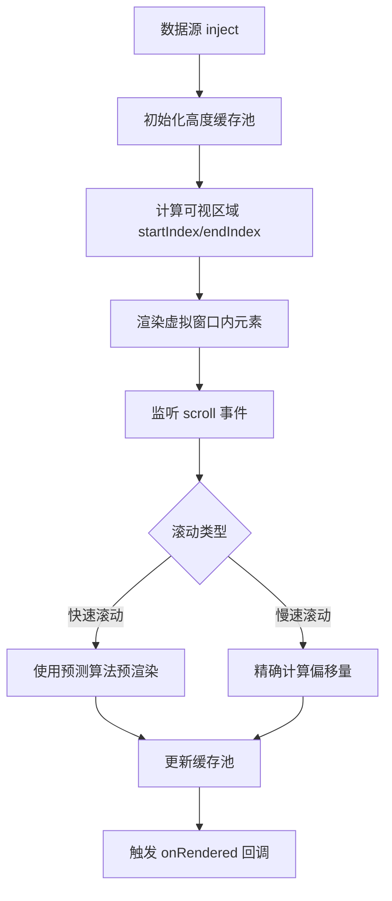

# 🚦 商业级多端虚拟长列表引擎 - 技术设计提案（V1.0）

> **提案版本**：V1.0 初稿  
> **提案日期**：2026年03月04日  
> **适用范围**：UniApp 多端（微信小程序 + H5 + APP-PLUS）虚拟长列表场景  
> **核心目标**：解决 1000+ 条数据滚动卡顿/白屏崩溃问题  
> ** phase**：Phase 0 - 蓝灯阶段（Design & Alignment）

---

## 📋 需求核心目标与边界

### ✅ 核心目标
| 维度 | 目标描述 |
| :--- | :--- |
| **性能** | 支持 1000+ 条数据滚动流畅（60fps），内存占用降低 80%+ |
| **兼容性** | 微信小程序、H5、APP-PLUS 三端统一 API，无平台差异 |
| **动态高度** | 支持每行高度动态变化（如图文混排、评论内容长度不一） |
| **缓冲区** | 上下缓冲区防白屏，快速滑动不出现空白区域 |

### ❌ 明确不包含（边界）
1. **不实现虚拟网格（Virtual Grid）** - 仅支持单列虚拟列表
2. **不实现 Sticky 粘性头部** - 后续可扩展
3. **不依赖第三方组件库** - 纯手写底层引擎
4. **不处理服务端分页** - 仅处理前端已加载的完整数据源

---

## 🔄 核心业务流梳理



---

## 🛡️ 商业级交互与异常场景补全

| 场景 | 处理方案 |
| :--- | :--- |
| **首次渲染白屏** | 设置 `min-height` 占位，或显示 skeleton 骨架屏 |
| **高度缓存缺失** | 动态测量单个节点，补充到缓存池 |
| **快速滑动导致空白** | 上下各增加 3-5 个元素的缓冲区（Buffer） |
| **异步数据加载** | 监听数据变化，自动调整总高度 |
| ** scrollsToBottom** | 提供 `scrollToIndex()` API 强制滚动 |
| **内存泄漏风险** | 使用 `onUnmounted` 清理所有事件监听器 |

---

## 🏗️ 技术实现架构方案

### 📁 目录结构设计

```
utils/
└── virtual/
    ├── types.ts              # 类型定义
    ├── utils.ts              # 工具函数（高度计算、缓存管理）
    └── useVirtualList.ts     # 核心组合式函数
```

### 🔑 核心计算原理

#### 1. **可视区域计算模型**

```
┌─────────────────────────────────────────────────┐
│  viewportOffset (滚动顶部偏移)                   │
├─────────────────────────────────────────────────┤
│  bufferStart (缓冲起点)                         │
├───────────────── virtualWindow ─────────────────┤
│  bufferEnd (缓冲终点)                           │
├─────────────────────────────────────────────────┤
│  totalHeight (列表总高度)                       │
└─────────────────────────────────────────────────┘
```

#### 2. **可视区间计算算法（伪代码）**

```typescript
// 核心公式
viewportOffset = scrollTop
startOffset = max(0, viewportOffset - bufferSize)
endOffset = min(scrollTop + viewportHeight + bufferSize, totalHeight)

// 通过前缀和数组二分查找对应索引
startIndex = findIndex(startOffset)  // O(log n)
endIndex = findIndex(endOffset)      // O(log n)
```

#### 3. **缓冲区（Buffer）设计**

| 参数 | 默认值 | 说明 |
| :--- | :--- | :--- |
| `bufferSize` | 200rpx | 上下各保留的缓冲高度 |
| `bufferCount` | 5 | 上下各保留的元素个数 |
| **作用** | 防止快速滑动时出现白屏 |

---

### 🐘 多端环境填坑（Height Cache 设计）

#### 问题分析

| 平台 | `uni.createSelectorQuery()` 特性 | 挑战 |
| :--- | :--- | :--- |
| **微信小程序** | 异步、批处理、延迟高 | 首次渲染高度全为 0 |
| **H5** | 同步、即时、性能好 | 可立即获取高度 |
| **APP-PLUS** | 视情况而定 | 需特殊处理 |

#### 方案：三级高度缓存机制

##### Level 1：预估高度（Initial Estimate）

```typescript
interface VirtualItem {
  key: string | number         // 唯一标识
  index: number                // 原始索引
  estimatedHeight: number      // 预估高度（默认 100rpx）
  actualHeight: number | null  // 实际高度（测量后更新）
  offset: number               // 累计偏移量
}
```

##### Level 2：动态测量（Measure on Render）

```typescript
// 渲染后测量
onMounted(() => {
  const rect = await measureItem(index)
  updateHeight(index, rect.height)
  recalculateOffsets(index)
})
```

##### Level 3：前缀和优化（Prefix Sum）

```typescript
// 前缀和数组，用于 O(log n) 二分查找
prefixHeights: number[] = [0, h0, h0+h1, h0+h1+h2, ...]

// 查找 offset 对应的索引
function findIndex(offset: number): number {
  let left = 0, right = prefixHeights.length
  while (left < right) {
    const mid = (left + right) >> 1
    if (prefixHeights[mid] < offset) left = mid + 1
    else right = mid
  }
  return left - 1
}
```

#### 多端适配策略

```typescript
const usePlatformAdapter = () => {
  const isMiniProgram = process.env.VUE_PLATFORM === 'mp-weixin'
  const isH5 = process.env.VUE_PLATFORM === 'h5'
  
  const measureElement = (selector: string): Promise<UniApp.NodeBoundingRect> => {
    if (isH5) {
      // H5 同步获取
      const el = document.querySelector(selector)
      return Promise.resolve(el.getBoundingClientRect())
    } else {
      // 小程序异步获取
      return new Promise((resolve, reject) => {
        const query = uni.createSelectorQuery()
        query.select(selector).boundingClientRect(resolve)
        query.exec()
      })
    }
  }
  
  return { measureElement }
}
```

---

### 💡 API 暴露设计

#### 核心组合式函数：`useVirtualList`

```typescript
interface UseVirtualListOptions<T> {
  // 必填
  list: Ref<T[]>                  // 完整数据源
  itemHeight: number              // 预估高度（首次使用）
  
  // 可选
  bufferSize?: number             // 缓冲区高度（默认 200）
  itemKey?: (item: T) => string   // key 生成函数（默认 index）
  onRendered?: (start: number, end: number) => void
  
  // 高级
  estimatedItemHeight?: number    // 初始预估高度
  containerSelector?: string      // 容器选择器（默认 auto）
}

interface UseVirtualListReturn<T> {
  // 渲染列表（仅当前视窗+缓冲区）
  renderList: ComputedRef<T[]>
  
  // 容器样式
  containerStyle: ComputedRef<{ height: string }>
  
  // 偏移量（用于虚拟项定位）
  offsetY: Ref<number>
  
  // API
  scrollToIndex: (index: number) => void
  scrollToBottom: () => void
  refresh: () => void  // 重新计算所有高度
  
  // 状态
  isLoading: Ref<boolean>
  totalHeight: ComputedRef<number>
}
```

#### 使用示例

```vue
<script setup lang="ts">
import { useVirtualList } from '@/utils/virtual/useVirtualList'

const merchantList = ref<MerchantItem[]>([]) // 1000+ 条数据

const { renderList, containerStyle, scrollToIndex } = useVirtualList({
  list: merchantList,
  itemHeight: 240, // 预估高度
  bufferSize: 200,
  itemKey: (item) => item.merchant_id.toString(),
  onRendered: (start, end) => {
    console.log(`渲染区间: ${start} ~ ${end}`)
  }
})
</script>

<template>
  <scroll-view 
    class="virtual-list-container"
    @scroll="handleScroll"
    :style="containerStyle"
  >
    <view 
      v-for="item in renderList" 
      :key="item.merchant_id"
      class="merchant-card"
    >
      <!-- 业务内容 -->
    </view>
  </scroll-view>
</template>
```

---

### 🧰 工具函数设计

#### `utils.ts` - 高度计算工具

```typescript
// 计算前缀和
export function calculatePrefixHeights(heights: number[]): number[] {
  const prefix = [0]
  heights.forEach((h, i) => {
    prefix[i + 1] = prefix[i] + h
  })
  return prefix
}

// 二分查找索引
export function binarySearchPrefix(prefix: number[], target: number): number {
  let l = 0, r = prefix.length
  while (l < r) {
    const mid = (l + r) >> 1
    if (prefix[mid] < target) l = mid + 1
    else r = mid
  }
  return l - 1
}
```

#### `types.ts` - 类型定义

```typescript
export interface VirtualItemMeta {
  key: string | number
  index: number
  height: number
  offset: number
}

export interface VirtualListState {
  startIndex: number
  endIndex: number
  scrollTop: number
  totalHeight: number
  heights: Map<string | number, number>
  prefixHeights: number[]
}
```

---

## 🧪 后续测试覆盖范围规划

### 红灯阶段测试用例规划

| 测试类型 | 测试场景 | 验收标准 |
| :--- | :--- | :--- |
| **正常流** | 渲染 1000 条数据 | 首屏 50ms 内完成 |
| **正常流** | 快速上下滚动 | 无白屏、无卡顿 |
| **异常流** | 高度测量失败 | 使用 fallback 高度 |
| **异常流** | 数据动态更新 | 列表自动重算高度 |
| **边界值** | 空数据列表 | 显示空状态提示 |
| **边界值** | 单条数据极高（>5000rpx） | 不出现重叠 |

### 核心测量指标

| 指标 | 目标值 | 测量方式 |
| :--- | :--- | :--- |
| 首屏渲染时间 | < 50ms | Performance API |
| 滚动帧率 | 60fps | requestAnimationFrame |
| 内存占用 | < 20MB | Heap Snapshot |
| DOM 节点数 | < 30 个 | DevTools Profiler |

---

## 📂 文档与代码归档规划

### 文件命名规范

```
docs/tdd/virtual-list/
├── 0-蓝灯设计提案-20260304.md     # 本文档
├── 1-红灯测试用例-20260304.md
├── 2-绿灯实现代码-20260304.md
└── 3-重构交付代码-20260304.md
```

### 新增文件清单

| 路径 | 类型 | 说明 |
| :--- | :--- | :--- |
| `utils/virtual/types.ts` | 类型定义 | TypeScript 类型导出 |
| `utils/virtual/utils.ts` | 工具函数 | 高度计算、缓存管理 |
| `utils/virtual/useVirtualList.ts` | 核心逻辑 | 主要组合式函数 |
| `docs/tdd/virtual-list/` | 文档归档 | 完整 TDD 文档 |

---

## 🎯 设计提案总结

| 维度 | 方案亮点 |
| :--- | :--- |
| **性能优化** | 前缀和 + 二分查找 = O(log n) 区间计算 |
| **多端兼容** | 平台适配层 + 三级高度缓存机制 |
| **API 设计** | 纯函数式组合式 API，零副作用 |
| **容错能力** | 动态高度测量 + fallback 机制 |
| **扩展性** | 支持后续添加 Sticky、网格等高级功能 |

---

## 🚦 本阶段标准结束语

> **以上是《商业级多端虚拟长列表引擎》的交互与技术设计提案，请问是否同意？**
> 
> **（同意后我将进入红灯阶段，编写对应自动化测试用例）**

---

## 📌 附录：关键技术决策说明

### Q1: 为什么选择前缀和 + 二分查找？
- **A**: 前缀和数组可以 O(1) 时间计算任意区间的高度总和，二分查找可以在 O(log n) 时间定位索引，整体性能最优。

### Q2: 为什么需要三级高度缓存？
- **A**: 小程序端无法同步获取高度，必须先用预估高度渲染，再通过测量更新，三阶段缓存确保平滑过渡。

### Q3: 为什么不用第三方库？
- **A**: `vue-virtual-scroll-list` 等库不支持动态高度，且与 UniApp 小程序环境兼容性差，手写可完全控制性能与行为。

---

**【架构师挂起等待您的审批】** ⏸️
